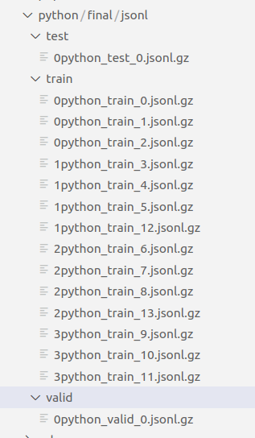

# semantic-code-search

TF 2.x support for the [CodeSearchNet](https://github.com/github/CodeSearchNet) challenge. Tested in TF 2.1 with `horovod` for multi GPU training. Utilized CodeGPT as an encoder for code and query.
## Install the python dependencies
```
pip3 install -r src/requirement.txt
```
## Download the dataset
```
cd script
python3 download_dataset.py ../resources/data
```

Split the dataset accross workers/GPUs to for distributed training using `horovod`. Prepend the GPU rank (i.e rank=0 if you have only 1 GPU) to the `jsonl.gz` files in the `resources/data/python/final/jsonl/train/` directory.
 

## Train CodeGPT model
```
cd src
python3 train.py --model gpt2
```

## Sample Result

This is the sample result after training CodeGPT on the `python` data<br>
Test MRR: 0.026
|Rank|Language|Query                                                                                                                                                                                                                                                                                                                                                                                                                                                                                                                                                                                                                                                                                                                                                                                                                                                                                                                                                                                                                                                                                                                                                                                                                                                                                                                                                                                                                              |Func-name                                          |Code                                                                                                                                                                                                                                                                                                                                                                                                                                                                                                                                                                                                                                                                                                                                                                                                                                                                                                                                                                                                                                                                                                                                                                                                                                                                                                                                                                                                                                                                                                                                                                                                                                                                                                                                                                                                                                                                                                                                                                                                                                                                                                                                                                                                                                                                                                                                                                                                                                                                                                                                                                                                                                                                                                                                                                                                                                                                                                                                                                                                                                                                                                                                                                                                                                                                                                                                                                                                                                                                                                                                                                                                                                                                                                                                                                                                                                                                                                                                                                                                                                                                                                                                                                                                                                                                                                                                                                                                                                                                                                                                                                                                                                    |
|----|--------|-----------------------------------------------------------------------------------------------------------------------------------------------------------------------------------------------------------------------------------------------------------------------------------------------------------------------------------------------------------------------------------------------------------------------------------------------------------------------------------------------------------------------------------------------------------------------------------------------------------------------------------------------------------------------------------------------------------------------------------------------------------------------------------------------------------------------------------------------------------------------------------------------------------------------------------------------------------------------------------------------------------------------------------------------------------------------------------------------------------------------------------------------------------------------------------------------------------------------------------------------------------------------------------------------------------------------------------------------------------------------------------------------------------------------------------|---------------------------------------------------|----------------------------------------------------------------------------------------------------------------------------------------------------------------------------------------------------------------------------------------------------------------------------------------------------------------------------------------------------------------------------------------------------------------------------------------------------------------------------------------------------------------------------------------------------------------------------------------------------------------------------------------------------------------------------------------------------------------------------------------------------------------------------------------------------------------------------------------------------------------------------------------------------------------------------------------------------------------------------------------------------------------------------------------------------------------------------------------------------------------------------------------------------------------------------------------------------------------------------------------------------------------------------------------------------------------------------------------------------------------------------------------------------------------------------------------------------------------------------------------------------------------------------------------------------------------------------------------------------------------------------------------------------------------------------------------------------------------------------------------------------------------------------------------------------------------------------------------------------------------------------------------------------------------------------------------------------------------------------------------------------------------------------------------------------------------------------------------------------------------------------------------------------------------------------------------------------------------------------------------------------------------------------------------------------------------------------------------------------------------------------------------------------------------------------------------------------------------------------------------------------------------------------------------------------------------------------------------------------------------------------------------------------------------------------------------------------------------------------------------------------------------------------------------------------------------------------------------------------------------------------------------------------------------------------------------------------------------------------------------------------------------------------------------------------------------------------------------------------------------------------------------------------------------------------------------------------------------------------------------------------------------------------------------------------------------------------------------------------------------------------------------------------------------------------------------------------------------------------------------------------------------------------------------------------------------------------------------------------------------------------------------------------------------------------------------------------------------------------------------------------------------------------------------------------------------------------------------------------------------------------------------------------------------------------------------------------------------------------------------------------------------------------------------------------------------------------------------------------------------------------------------------------------------------------------------------------------------------------------------------------------------------------------------------------------------------------------------------------------------------------------------------------------------------------------------------------------------------------------------------------------------------------------------------------------------------------------------------------------------------------------------|
|326 |python  |Promote 2-bit unisgned data into 8-bit unsigned data.      Args:         data: Numpy array with dtype == uint8      Notes:         # The process is this:         # ABCDEFGH [Bits of one 4+4-bit value]         # 00000000ABCDEFGH [astype(uint16)]         # 0000ABCDEFGH0000 [<< 4]         # 0000ABCDXXXXEFGH [bitwise 'or' of previous two lines]         # 0000111100001111 [0x0F0F]         # 0000ABCD0000EFGH [bitwise 'and' of previous two lines]         # ABCD0000EFGH0000 [<< 4]         # which effectively pads the two 4-bit values with zeros on the right         # Note: This technique assumes LSB-first ordering                                                                                                                                                                                                                                                                                                                                                                                                                                                                                                                                                                                                                                                                                                                                                                                              |unpack_4to8                                        |```python def unpack_4to8(data):     """ Promote 2-bit unisgned data into 8-bit unsigned data.      Args:         data: Numpy array with dtype == uint8      Notes:         # The process is this:         # ABCDEFGH [Bits of one 4+4-bit value]         # 00000000ABCDEFGH [astype(uint16)]         # 0000ABCDEFGH0000 [<< 4]         # 0000ABCDXXXXEFGH [bitwise 'or' of previous two lines]         # 0000111100001111 [0x0F0F]         # 0000ABCD0000EFGH [bitwise 'and' of previous two lines]         # ABCD0000EFGH0000 [<< 4]         # which effectively pads the two 4-bit values with zeros on the right         # Note: This technique assumes LSB-first ordering     """      tmpdata = data.astype(np.int16)  # np.empty(upshape, dtype=np.int16)     tmpdata = (tmpdata &#124; (tmpdata << 4)) & 0x0F0F     # tmpdata = tmpdata << 4 # Shift into high bits to avoid needing to sign extend     updata = tmpdata.byteswap()     return updata.view(data.dtype) ```                                                                                                                                                                                                                                                                                                                                                                                                                                                                                                                                                                                                                                                                                                                                                                                                                                                                                                                                                                                                                                                                                                                                                                                                                                                                                                                                                                                                                                                                                                                                                                                                                                                                                                                                                                                                                                                                                                                                                                                                                                                                                                                                                                                                                                                                                                                                                                                                                                                                                                                                                                                                                                                                                                                                                                                                                                                                                                                                                                                                                                                                                                                                                                                                                                                                                                                                                                                                                                                                                                                                                                                                                                                           |
|7   |python  |Parse the file called mim2gene          This file describes what type(s) the different mim numbers have.     The different entry types are: 'gene', 'gene/phenotype', 'moved/removed',     'phenotype', 'predominantly phenotypes'     Where:         gene: Is a gene entry         gene/phenotype: This entry describes both a phenotype and a gene         moved/removed: No explanation needed         phenotype: Describes a phenotype         predominantly phenotype: Not clearly established (probably phenotype)          Args:         lines(iterable(str)): The mim2gene lines          Yields:         parsed_entry(dict)              {             "mim_number": int,              "entry_type": str,              "entrez_gene_id": int,              "hgnc_symbol": str,              "ensembl_gene_id": str,             "ensembl_transcript_id": str,         }                                                                                                                                                                                                                                                                                                                                                                                                                                                                                                                                                   |parse_mim2gene                                     |```python def parse_mim2gene(lines):     """Parse the file called mim2gene          This file describes what type(s) the different mim numbers have.     The different entry types are: 'gene', 'gene/phenotype', 'moved/removed',     'phenotype', 'predominantly phenotypes'     Where:         gene: Is a gene entry         gene/phenotype: This entry describes both a phenotype and a gene         moved/removed: No explanation needed         phenotype: Describes a phenotype         predominantly phenotype: Not clearly established (probably phenotype)          Args:         lines(iterable(str)): The mim2gene lines          Yields:         parsed_entry(dict)              {             "mim_number": int,              "entry_type": str,              "entrez_gene_id": int,              "hgnc_symbol": str,              "ensembl_gene_id": str,             "ensembl_transcript_id": str,         }          """     LOG.info("Parsing mim2gene")     header = ["mim_number", "entry_type", "entrez_gene_id", "hgnc_symbol", "ensembl_gene_id"]     for i, line in enumerate(lines):         if line.startswith('#'):             continue                  if not len(line) > 0:             continue          line = line.rstrip()         parsed_entry = parse_omim_line(line, header)         parsed_entry['mim_number'] = int(parsed_entry['mim_number'])         parsed_entry['raw'] = line                  if 'hgnc_symbol' in parsed_entry:             parsed_entry['hgnc_symbol'] = parsed_entry['hgnc_symbol']                  if parsed_entry.get('entrez_gene_id'):             parsed_entry['entrez_gene_id'] = int(parsed_entry['entrez_gene_id'])                  if parsed_entry.get('ensembl_gene_id'):             ensembl_info = parsed_entry['ensembl_gene_id'].split(',')             parsed_entry['ensembl_gene_id'] = ensembl_info[0].strip()             if len(ensembl_info) > 1:                 parsed_entry['ensembl_transcript_id'] = ensembl_info[1].strip()                  yield parsed_entry ```                                                                                                                                                                                                                                                                                                                                                                                                                                                                                                                                                                                                                                                                                                                                                                                                                                                                                                                                                                                                                                                                                                                                                                                                                                                                                                                                                                                                                                                                                                                                                                                                                                                                                                                                                                                                                                                                                                                                                                                                                                                                                                                                                                                                                                                                                                                                                                                                                                                                                                                                                                         |
|70  |python  |Generates an invoice with a cancellation fee, and applies         credit to the invoice.          percentage (Decimal): The percentage of the credit note to turn into         a cancellation fee. Must be 0 <= percentage <= 100.                                                                                                                                                                                                                                                                                                                                                                                                                                                                                                                                                                                                                                                                                                                                                                                                                                                                                                                                                                                                                                                                                                                                                                                                 |CreditNoteController.cancellation_fee              |```python def cancellation_fee(self, percentage):         ''' Generates an invoice with a cancellation fee, and applies         credit to the invoice.          percentage (Decimal): The percentage of the credit note to turn into         a cancellation fee. Must be 0 <= percentage <= 100.         '''          # Local import to fix import cycles. Can we do better?         from .invoice import InvoiceController          assert(percentage >= 0 and percentage <= 100)          cancellation_fee = self.credit_note.value * percentage / 100         due = datetime.timedelta(days=1)         item = [("Cancellation fee", cancellation_fee)]         invoice = InvoiceController.manual_invoice(             self.credit_note.invoice.user, due, item         )          if not invoice.is_paid:             self.apply_to_invoice(invoice)          return InvoiceController(invoice) ```                                                                                                                                                                                                                                                                                                                                                                                                                                                                                                                                                                                                                                                                                                                                                                                                                                                                                                                                                                                                                                                                                                                                                                                                                                                                                                                                                                                                                                                                                                                                                                                                                                                                                                                                                                                                                                                                                                                                                                                                                                                                                                                                                                                                                                                                                                                                                                                                                                                                                                                                                                                                                                                                                                                                                                                                                                                                                                                                                                                                                                                                                                                                                                                                                                                                                                                                                                                                                                                                                                                                                                                                                                                                                                                                 |
|217 |python  |Update an existing gene panel with genes.      Args:         store(scout.adapter.MongoAdapter)         panel_name(str)         csv_lines(iterable(str)): Stream with genes         option(str): 'add' or 'replace'      Returns:         panel_obj(dict)                                                                                                                                                                                                                                                                                                                                                                                                                                                                                                                                                                                                                                                                                                                                                                                                                                                                                                                                                                                                                                                                                                                                                                           |update_panel                                       |```python def update_panel(store, panel_name, csv_lines, option):     """Update an existing gene panel with genes.      Args:         store(scout.adapter.MongoAdapter)         panel_name(str)         csv_lines(iterable(str)): Stream with genes         option(str): 'add' or 'replace'      Returns:         panel_obj(dict)     """     new_genes= []     panel_obj = store.gene_panel(panel_name)     if panel_obj is None:         return None     try:         new_genes = parse_genes(csv_lines) # a list of gene dictionaries containing gene info     except SyntaxError as error:         flash(error.args[0], 'danger')         return None      # if existing genes are to be replaced by those in csv_lines     if option == 'replace':         # all existing genes should be deleted         for gene in panel_obj['genes']:             #create extra key to use in pending actions:             gene['hgnc_symbol'] = gene['symbol']             store.add_pending(panel_obj, gene, action='delete', info=None)      for new_gene in new_genes:         if not new_gene['hgnc_id']:             flash("gene missing hgnc id: {}".format(new_gene['hgnc_symbol']),'danger')             continue         gene_obj = store.hgnc_gene(new_gene['hgnc_id'])         if gene_obj is None:             flash("gene not found: {} - {}".format(new_gene['hgnc_id'], new_gene['hgnc_symbol']),'danger')             continue         if new_gene['hgnc_symbol'] and gene_obj['hgnc_symbol'] != new_gene['hgnc_symbol']:             flash("symbol mis-match: {0} &#124; {1}".format(                 gene_obj['hgnc_symbol'], new_gene['hgnc_symbol']), 'warning')          info_data = {             'disease_associated_transcripts': new_gene['transcripts'],             'reduced_penetrance': new_gene['reduced_penetrance'],             'mosaicism': new_gene['mosaicism'],             'inheritance_models': new_gene['inheritance_models'],             'database_entry_version': new_gene['database_entry_version'],         }         if option == 'replace': # there will be no existing genes for sure, because we're replacing them all             action = 'add'         else: # add option. Add if genes is not existing. otherwise edit it             existing_genes = {gene['hgnc_id'] for gene in panel_obj['genes']}             action = 'edit' if gene_obj['hgnc_id'] in existing_genes else 'add'         store.add_pending(panel_obj, gene_obj, action=action, info=info_data)      return panel_obj ```                                                                                                                                                                                                                                                                                                                                                                                                                                                                                                                                                                                                                                                                                                                                                                                                                                                                                                                                                                                                                                                                                                                                                                                                                                                                                                                                                                                                                                                                                                                                                                                                                                                                                                                                                                                                                                                                                                                                                                                                                                                                                               |
|239 |python  |Index all the keys added so far and make them searchable.                                                                                                                                                                                                                                                                                                                                                                                                                                                                                                                                                                                                                                                                                                                                                                                                                                                                                                                                                                                                                                                                                                                                                                                                                                                                                                                                                                          |MinHashLSHForest.index                             |```python def index(self):         '''         Index all the keys added so far and make them searchable.         '''         for i, hashtable in enumerate(self.hashtables):             self.sorted_hashtables[i] = [H for H in hashtable.keys()]             self.sorted_hashtables[i].sort() ```                                                                                                                                                                                                                                                                                                                                                                                                                                                                                                                                                                                                                                                                                                                                                                                                                                                                                                                                                                                                                                                                                                                                                                                                                                                                                                                                                                                                                                                                                                                                                                                                                                                                                                                                                                                                                                                                                                                                                                                                                                                                                                                                                                                                                                                                                                                                                                                                                                                                                                                                                                                                                                                                                                                                                                                                                                                                                                                                                                                                                                                                                                                                                                                                                                                                                                                                                                                                                                                                                                                                                                                                                                                                                                                                                                                                                                                                                                                                                                                                                                                                                                                                                                                                                                                                                                                                     |


## Contribute

An easy way would be to try different models from the [Hugging Face](https://huggingface.co/docs/transformers/master/index) transformers library to encode code and queries.